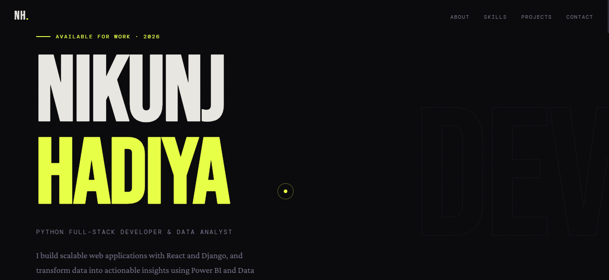
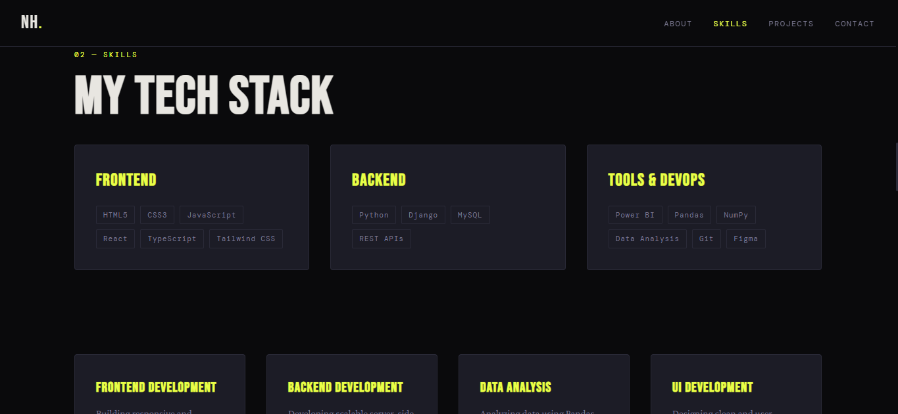
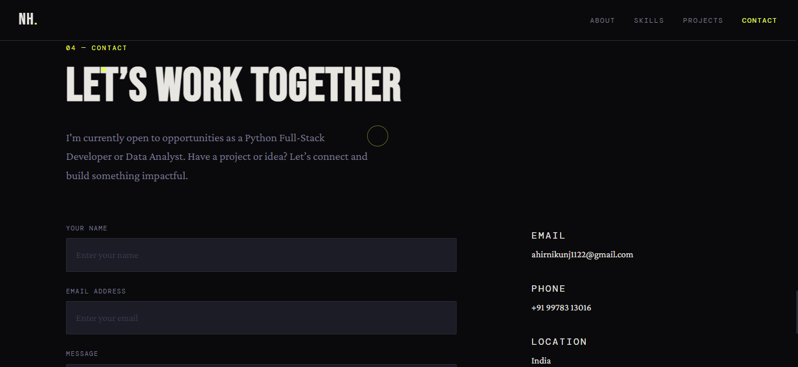
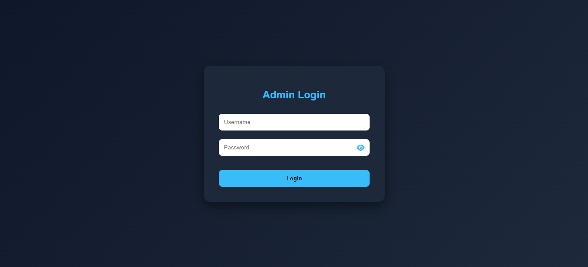
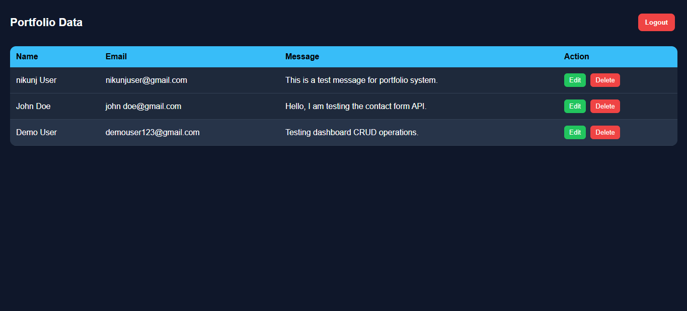

# 🌐 Portfolio + Admin Dashboard (Full Stack Project)

This is a full-stack **Portfolio Website with Admin Dashboard** built using:

- HTML, CSS, JavaScript
- Node.js, Express.js
- MongoDB Atlas
- REST API integration

---

## 🚀 Features

### 🎨 Portfolio Website
- Modern responsive UI
- Hero, About, Skills, Projects, Contact sections
- Smooth animations
- Mobile friendly design

### 📩 Contact System
- Contact form submits data to backend
- Data stored in MongoDB
- API integration with Express

### 🔐 Admin Login
- Simple authentication using sessionStorage
- Protected dashboard access
- Auto redirect if not logged in

### 📊 Admin Dashboard
- View all contact messages
- Edit data (modal popup)
- Delete records
- Responsive table UI

---

## 🛠️ Tech Stack

| Frontend        | Backend       | Database      |
|-----------------|---------------|---------------|
| HTML5           | Node.js       | MongoDB Atlas |
| CSS3            | Express.js    | Mongoose      |
| JavaScript (Vanilla) |          |               |

---

## 📁 Project Structure

```
PORTFOLIO/
│
├── backend/
│   ├── models/
│   │   └── Contact.js
│   ├── routes/
│   │   └── contactRoutes.js
│   ├── node_modules/
│   ├── .env
│   ├── package.json
│   ├── package-lock.json
│   └── server.js
│
├── portfolio/
│   ├── assets/
│   │   └── myphoto.PNG
│   │
│   ├── CSS/
│   │   ├── reset.css
│   │   ├── variables.css
│   │   ├── layout.css
│   │   ├── animations.css
│   │   ├── nav.css
│   │   ├── hero.css
│   │   ├── about.css
│   │   ├── skills.css
│   │   ├── projects.css
│   │   └── contact.css
│   │
│   ├── dashboard/
│   │   ├── dashboard.html
│   │   ├── dashboard.css
│   │   └── dashboard.js
│   │
│   ├── JS/
│   │   ├── animations.js
│   │   ├── contact.js
│   │   ├── cursor.js
│   │   ├── nav.js
│   │   ├── skills.js
│   │   └── login.js
│   │
│   ├── index.html
│   ├── login.html
│   └── login.css
│
└── README.md
```

---

## 🚀 How to Run Project

### 1️⃣ Clone the Repository
```bash
git clone https://github.com/nikunjhadiya/portfolio
cd portfolio
```

### 2️⃣ Backend Setup
```bash
cd backend
npm install
```

### 3️⃣ Create `.env` File
Inside the `backend/` folder, create a `.env` file:
```env
MONGO_URI=your_mongodb_connection_string
PORT=5000
```

### 4️⃣ Start Backend Server
```bash
npm start
```
> Server runs on: `http://localhost:5000`

### 5️⃣ Run Frontend
Open in browser:
```
portfolio/index.html        ← Portfolio Website
portfolio/login.html        ← Admin Login Page
```

---

## 🔗 API Endpoints

| Method   | Route                  | Description          |
|----------|------------------------|----------------------|
| `POST`   | `/api/contact`         | Save contact form    |
| `GET`    | `/api/contact`         | Get all messages     |
| `PUT`    | `/api/contact/:id`     | Update a record      |
| `DELETE` | `/api/contact/:id`     | Delete a record      |

---

## 🔐 Admin Credentials

```
Username : admin
Password : admin123
```
> ⚠️ Change these credentials before deploying to production.

---

## 📸 Pages Overview

### 🏠 Home Page


---

### 🧠 Skills Page


---

### 📩 Contact Page


---

### 🔑 Dashboard Login


---

### 📊 Dashboard Data Table

---

## 👨‍💻 Connect with Me

- 🔗 LinkedIn: https://www.linkedin.com/in/nikunjhadiya
- 💻 GitHub: https://github.com/nikunjhadiya


## 👨‍💻 Author

**Nikunj Hadiya**

- Full Stack Developer Project
- Portfolio + Admin Dashboard System
- MongoDB + Node.js Practice Project


## 🌐 Live Portfolio

🚀 View Live Website:  
👉 https://nikunjhadiya.netlify.app/
---

## 📌 Status

| Feature           | Status  |
|-------------------|---------|
| Portfolio UI      | ✅ Done |
| Contact Form API  | ✅ Done |
| Admin Login       | ✅ Done |
| Admin Dashboard   | ✅ Done |
| CRUD Operations   | ✅ Done |
| Responsive Design | ✅ Done |

---

## ⭐ Note

If you like this project, please give it a ⭐ on GitHub!

---
